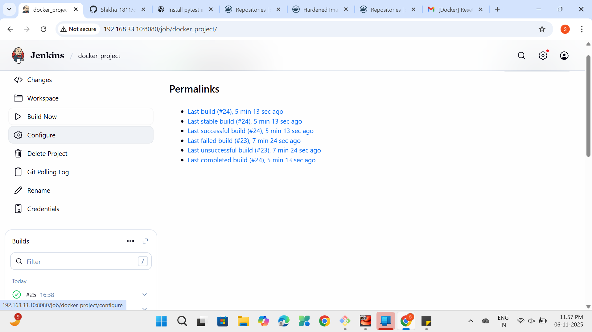
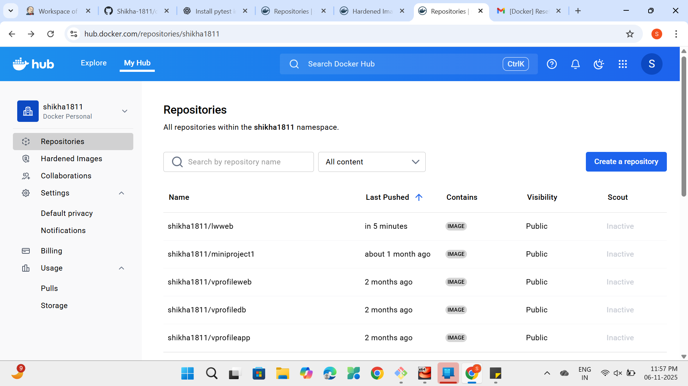

# 🚀 Flask App CI/CD Pipeline with Jenkins, Docker & GitHub Integration

This project demonstrates how to build, test, and deploy a simple Flask web application using Docker and a Jenkins CI/CD pipeline.
It showcases the complete automation workflow — from code commit to container deployment, all running inside a EuroLinux virtual environment using Vagrant.

---

## 🧩 Tech Stack

- **Frontend / Backend:** Python (Flask)
- **Version Control:** Git & GitHub
- **CI/CD Tool:** Jenkins
- **Containerization:** Docker
- **Image Registry:** DockerHub
- **Testing:** pytest
- **Virtual Machine Environment:** Vagrant with EuroLinux Box

---

## 📁 Project Structure

```
├── app.py # Main Flask application
├── Dockerfile # Docker build configuration
├── test_app.py # Unit tests for Flask app
└── README.md # Documentation
```

---

## ⚙️ Prerequisites

Before setting up the pipeline, ensure the following are installed and configured:

- ✅ **Git** – for version control
- ✅ **Python 3.x** – to run Flask app
- ✅ **Docker** – for containerization
- ✅ **Jenkins** – for CI/CD automation
- ✅ **DockerHub Account** – to push Docker images
- ✅ **GitHub Repository** – for source code management

---

## 🐳 Docker Setup

### Dockerfile

```
FROM redhat/ubi8
RUN yum install python3 -y
RUN pip3 install flask
COPY app.py /app.py
CMD ["python3", "/app.py"]
```

## 🧠 Build & Run the Container (Locally)

If you want to test the application locally before automating via Jenkins:

```bash
# Clone the project
git https://github.com/Shikha-1811/dockerproject_ci-cd.git
cd dockerproject_ci-cd

# Build Docker image
docker build -t flask-app .

# Run the container
docker run -d -p 5000:5000 flask-app
```

Once the container runs, visit 👉 http://localhost:5000 to see your Flask app running.

## 🧪 Run Tests

Run unit tests inside the container to ensure your application is functioning correctly.

```
# Run tests

pytest test_app.py

If all tests pass ✅, Jenkins will automatically proceed to the next stage (image push).
```

## ☁️ Push Image to DockerHub (Automated via Jenkins)

The Docker image push process is completely automated in Jenkins — no manual steps required.

### 🔒 Jenkins handles:

Logging into DockerHub using stored credentials

Tagging the built image with your DockerHub repository name

Pushing the image to DockerHub

Example (runs inside Jenkins shell step)

```
# Build image
docker build -t flask-app .

# Login securely using Jenkins credentials
echo "$DOCKERHUB_PASSWORD" | docker login -u "$DOCKERHUB_USERNAME" --password-stdin

# Tag & push image
docker tag flask-app $DOCKERHUB_USERNAME/flask-app:latest
docker push $DOCKERHUB_USERNAME/flask-app:latest
```

### 🧠 Jenkins credentials are stored securely under:

Manage Jenkins → Credentials → Global → Add Credentials

### 🔁 Jenkins CI/CD Setup

This project uses a Freestyle Jenkins job integrated with GitHub and DockerHub.
The pipeline is configured to run automatically whenever you push changes to GitHub.

## 🧩 Pipeline Workflow

1. Trigger: Code pushed to GitHub → Jenkins job automatically starts

2. Checkout: Jenkins pulls the latest code

3. Build: Jenkins runs docker build to create the Docker image

4. Test: Jenkins executes pytest test_app.py to validate the app

5. Push: Jenkins logs in to DockerHub and pushes the new image

6. Deploy: Jenkins can optionally deploy or run the new container

## ⚡ Jenkins Configuration Steps

1️⃣ Install Required Plugins

Git Plugin

Docker Plugin

Docker Pipeline Plugin

Credentials Binding Plugin

2️⃣ Configure Jenkins Credentials

Add your DockerHub credentials in Jenkins:

Go to: Manage Jenkins → Credentials → Add Credentials

Type: Username and Password

ID Example: dockerhub_credentials

3️⃣ Create Jenkins Job

Choose Freestyle Project

Under Source Code Management, select Git → Add your repository URL

Under Build Triggers, select:

✅ Poll SCM (\* \* \* \* \*) for every minute

4️⃣ Add Build Steps

Add the following Shell Command inside Jenkins:

```
# Build Docker image

docker build -t flask-app .

# Run tests

pytest test_app.py

# Login & Push Image

echo "$DOCKERHUB_PASSWORD" | docker login -u "$DOCKERHUB_USERNAME" --password-stdin
docker tag flask-app $DOCKERHUB_USERNAME/flask-app:latest
docker push $DOCKERHUB_USERNAME/flask-app:latest

# Optional: Deploy the container

docker run -d -p 5000:5000 $DOCKERHUB_USERNAME/flask-app:latest
```

🔄 Automated Trigger on GitHub Changes

Jenkins automatically starts the pipeline whenever there’s a new commit or PR in GitHub.

### 🧠 Common Method:

● Poll SCM :

● In Jenkins → Build Triggers → Enable Poll SCM

● Schedule example: \* \* \* \* \* (check every minute)

## 📦 DockerHub Output

After a successful Jenkins build, your image is pushed automatically to your DockerHub repository.

Example:

Successfully built abc123
Successfully tagged shikhapal/flask-app:latest
The push refers to repository [docker.io/shikhapal/flask-app]

✅ You can verify this on DockerHub
under your repositories.

### 🎯 Summary

Step Description Automated?
Code Push Push code to GitHub ✅
Build Jenkins builds Docker image ✅
Test Run unit tests ✅
Push to DockerHub Jenkins pushes image ✅
Deploy Jenkins runs container ✅

### 🌟 Outcome

This setup ensures:

● Continuous Integration and Continuous Deployment

● Secure Credential Handling

● Automated Trigger on Code Changes

● Fully Dockerized and Reproducible Builds

## ✨ Author

👩‍💻 Shikha Pal
💬 Cloud & DevOps Enthusiast
🔗https://www.linkedin.com/in/shikha-pal-095b9a27b
| https://github.com/Shikha-1811

### 📸 Screenshots

**1️⃣ Jenkins Build Success**


**2️⃣ Flask App Running in Browser**


**3️⃣ Docker Image Pushed to DockerHub**

